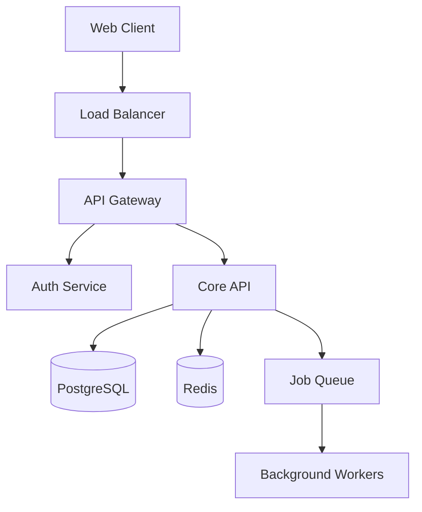
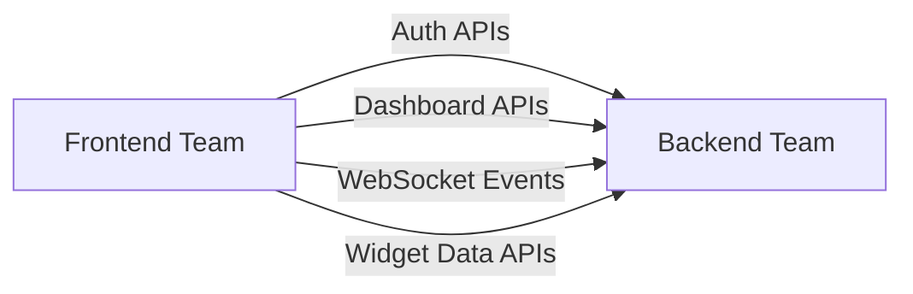
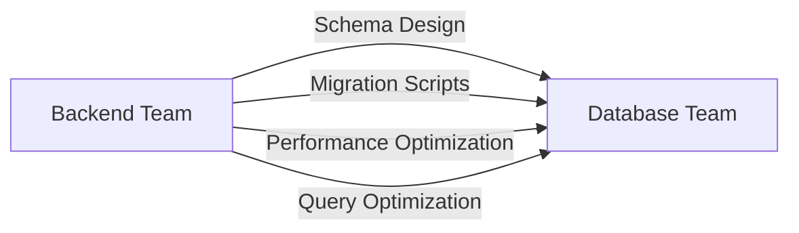
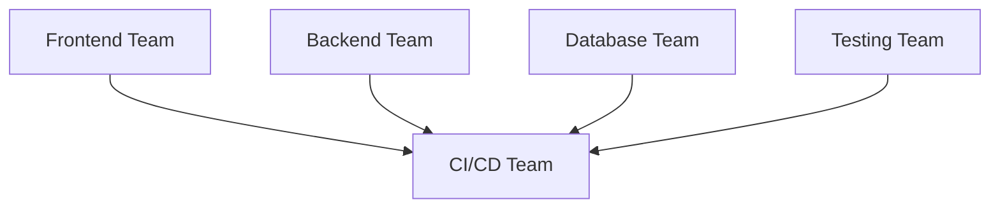

# Dashboard Web Application - Product Requirements Document (PRD)

**Project Codename:** DashFlow  
**Version:** 1.0  
**Date:** February 6, 2026  
**Target:** Autonomous AI Development Teams  

---

## 1. EXECUTIVE SUMMARY

### Vision Statement
Create a modern, extensible dashboard platform that enables real-time data visualization, user management, and customizable widgets with enterprise-grade security and performance.

### Value Proposition
- **For Users:** Intuitive interface for monitoring KPIs, managing data, and creating custom views
- **For Developers:** Modular architecture enabling rapid feature development and deployment
- **For Organizations:** Scalable analytics platform with role-based access control

### Success Metrics
- Sub-2 second initial page load
- 99.9% uptime SLA
- Support for 1000+ concurrent users
- Mobile-responsive design (100% compatibility)
- Zero-downtime deployments

### Core Differentiators
1. **AI-First Architecture:** Built for autonomous development and deployment
2. **Widget Ecosystem:** Pluggable components with standardized APIs
3. **Real-Time Everything:** Live data updates without page refreshes
4. **Security by Design:** Zero-trust architecture with comprehensive audit logs

---

## 2. TECHNICAL ARCHITECTURE

### Technology Stack

#### Frontend Stack
```
Framework: Next.js 14+ (React 18+)
Language: TypeScript 5+
Styling: Tailwind CSS 3+ with headlessUI
State Management: Zustand + TanStack Query
Build Tool: Vite 5+ (or Next.js built-in)
Package Manager: pnpm
```

#### Backend Stack
```
Runtime: Node.js 20+ LTS
Framework: Fastify 4+ or Express 5+
Language: TypeScript 5+
API Style: REST + GraphQL (optional)
Authentication: JWT + Refresh Tokens
Validation: Zod schemas
```

#### Database Design
```
Primary DB: PostgreSQL 16+
Cache Layer: Redis 7+
Search Engine: ElasticSearch 8+ (optional)
File Storage: AWS S3 or MinIO
```

#### Infrastructure
```
Containerization: Docker + Docker Compose
Orchestration: Kubernetes (optional for production)
Reverse Proxy: Nginx or Traefik
Monitoring: Prometheus + Grafana
```

### System Architecture



### Database Schema (Core Tables)

```sql
-- Users and Authentication
CREATE TABLE users (
    id SERIAL PRIMARY KEY,
    email VARCHAR(255) UNIQUE NOT NULL,
    password_hash VARCHAR(255) NOT NULL,
    first_name VARCHAR(100),
    last_name VARCHAR(100),
    role_id INTEGER REFERENCES roles(id),
    is_active BOOLEAN DEFAULT true,
    email_verified BOOLEAN DEFAULT false,
    created_at TIMESTAMP DEFAULT NOW(),
    updated_at TIMESTAMP DEFAULT NOW()
);

-- Role-Based Access Control
CREATE TABLE roles (
    id SERIAL PRIMARY KEY,
    name VARCHAR(50) UNIQUE NOT NULL,
    description TEXT,
    permissions JSONB DEFAULT '[]'
);

-- Dashboard Configuration
CREATE TABLE dashboards (
    id SERIAL PRIMARY KEY,
    user_id INTEGER REFERENCES users(id),
    title VARCHAR(200) NOT NULL,
    description TEXT,
    config JSONB DEFAULT '{}',
    is_public BOOLEAN DEFAULT false,
    created_at TIMESTAMP DEFAULT NOW(),
    updated_at TIMESTAMP DEFAULT NOW()
);

-- Widget System
CREATE TABLE widgets (
    id SERIAL PRIMARY KEY,
    dashboard_id INTEGER REFERENCES dashboards(id),
    widget_type VARCHAR(50) NOT NULL,
    title VARCHAR(200),
    config JSONB DEFAULT '{}',
    position_x INTEGER DEFAULT 0,
    position_y INTEGER DEFAULT 0,
    width INTEGER DEFAULT 4,
    height INTEGER DEFAULT 3,
    created_at TIMESTAMP DEFAULT NOW(),
    updated_at TIMESTAMP DEFAULT NOW()
);

-- Data Sources
CREATE TABLE data_sources (
    id SERIAL PRIMARY KEY,
    name VARCHAR(100) NOT NULL,
    type VARCHAR(50) NOT NULL, -- 'api', 'database', 'file'
    connection_config JSONB DEFAULT '{}',
    is_active BOOLEAN DEFAULT true,
    created_at TIMESTAMP DEFAULT NOW()
);

-- Audit Logs
CREATE TABLE audit_logs (
    id SERIAL PRIMARY KEY,
    user_id INTEGER REFERENCES users(id),
    action VARCHAR(100) NOT NULL,
    resource_type VARCHAR(50),
    resource_id INTEGER,
    details JSONB DEFAULT '{}',
    ip_address INET,
    user_agent TEXT,
    created_at TIMESTAMP DEFAULT NOW()
);
```

### API Structure

#### REST API Endpoints
```
Authentication:
POST   /api/auth/register
POST   /api/auth/login
POST   /api/auth/refresh
POST   /api/auth/logout
POST   /api/auth/forgot-password
POST   /api/auth/reset-password

User Management:
GET    /api/users
GET    /api/users/:id
PUT    /api/users/:id
DELETE /api/users/:id
GET    /api/users/:id/dashboards

Dashboards:
GET    /api/dashboards
POST   /api/dashboards
GET    /api/dashboards/:id
PUT    /api/dashboards/:id
DELETE /api/dashboards/:id
POST   /api/dashboards/:id/clone

Widgets:
GET    /api/dashboards/:id/widgets
POST   /api/dashboards/:id/widgets
PUT    /api/widgets/:id
DELETE /api/widgets/:id
GET    /api/widget-types

Data Sources:
GET    /api/data-sources
POST   /api/data-sources
PUT    /api/data-sources/:id
DELETE /api/data-sources/:id
POST   /api/data-sources/:id/test-connection

Analytics:
GET    /api/analytics/dashboard-usage
GET    /api/analytics/user-activity
GET    /api/analytics/system-metrics
```

#### WebSocket Events
```
Connection Events:
- dashboard.join
- dashboard.leave

Real-time Updates:
- widget.data.updated
- dashboard.config.changed
- user.presence.changed

System Events:
- system.maintenance.scheduled
- data.source.error
- auth.session.expired
```

---

## 3. FEATURE BREAKDOWN

### 3.1 Core Features

#### Dashboard Management
**Specification:**
- CRUD operations for dashboard creation, editing, deletion
- Drag-and-drop grid layout system (12-column responsive grid)
- Dashboard templates and cloning functionality
- Public/private dashboard sharing with granular permissions
- Dashboard favorites and recent access tracking

**Acceptance Criteria:**
- [ ] Users can create new dashboards with custom titles and descriptions
- [ ] Dashboard layout persists across sessions
- [ ] Responsive grid adapts to mobile/tablet/desktop viewports
- [ ] Share URLs generate unique tokens for public access
- [ ] Dashboard templates include: Analytics, Monitoring, Business Intelligence

#### Widget System
**Specification:**
- Modular widget architecture with standardized interfaces
- Widget types: Charts (Bar, Line, Pie, Scatter), Tables, Metrics, Maps, Text, Images
- Real-time data binding with configurable refresh intervals
- Widget-level permissions and data source filtering
- Custom widget development API

**Widget Interface Standard:**
```typescript
interface Widget {
  id: string;
  type: string;
  title: string;
  config: WidgetConfig;
  data: any[];
  position: GridPosition;
  isLoading: boolean;
  error?: string;
}

interface WidgetConfig {
  dataSource: string;
  refreshInterval: number; // seconds
  chartType?: string;
  filters?: FilterConfig[];
  styling?: StyleConfig;
}
```

#### Data Management
**Specification:**
- Multiple data source connectors (REST APIs, databases, CSV uploads)
- Data transformation pipeline with visual query builder
- Real-time data streaming with WebSocket connections
- Data caching with configurable TTL
- Historical data retention policies

**Data Source Types:**
1. **REST API:** HTTP/HTTPS endpoints with authentication
2. **Database:** PostgreSQL, MySQL, MongoDB connectors
3. **File Upload:** CSV, JSON, Excel file processing
4. **Real-time:** WebSocket and SSE stream handling

### 3.2 User Authentication & Authorization

#### Authentication System
**Specification:**
- JWT-based authentication with refresh token rotation
- Multi-factor authentication (TOTP/SMS)
- OAuth2 integration (Google, GitHub, Microsoft)
- Session management with concurrent session limits
- Password policies with complexity requirements

**Security Features:**
- Account lockout after failed attempts
- Rate limiting on authentication endpoints
- Audit logging for all authentication events
- Secure password reset with email verification
- Optional LDAP/Active Directory integration

#### Authorization Model
**Specification:**
- Role-Based Access Control (RBAC) with hierarchical permissions
- Resource-level permissions (dashboard, widget, data source)
- Permission inheritance and explicit overrides
- Team-based access management
- Audit trail for permission changes

**Default Roles:**
```typescript
enum DefaultRoles {
  SUPER_ADMIN = 'super_admin',
  ADMIN = 'admin', 
  EDITOR = 'editor',
  VIEWER = 'viewer',
  GUEST = 'guest'
}

interface Permission {
  resource: string;      // 'dashboard', 'widget', 'user'
  action: string;        // 'create', 'read', 'update', 'delete'
  scope: 'own' | 'team' | 'all';
}
```

### 3.3 User Interface Requirements

#### Design System
**Specification:**
- Consistent component library based on design tokens
- Dark/light theme support with system preference detection
- Accessibility compliance (WCAG 2.1 AA)
- Mobile-first responsive design
- Internationalization support (i18n)

**Component Library Structure:**
```
components/
├── ui/              # Basic UI components
│   ├── Button/
│   ├── Input/
│   ├── Modal/
│   └── Table/
├── dashboard/       # Dashboard-specific components
│   ├── Grid/
│   ├── WidgetContainer/
│   └── Toolbar/
└── widgets/         # Widget implementations
    ├── ChartWidget/
    ├── TableWidget/
    └── MetricWidget/
```

#### User Experience
**Specification:**
- Progressive loading with skeleton screens
- Optimistic UI updates with error rollback
- Contextual help and onboarding flows
- Keyboard navigation support
- Drag-and-drop interactions with visual feedback

**Performance Targets:**
- First Contentful Paint: < 1.5s
- Largest Contentful Paint: < 2.5s
- Time to Interactive: < 3s
- Widget render time: < 500ms
- Data fetch time: < 1s

---

## 4. WORKSTREAM ALLOCATION

### 4.1 Frontend Team

#### Responsibilities
- Component library development and maintenance
- User interface implementation
- Client-side state management
- Authentication flow integration
- Performance optimization

#### Deliverables
```
Phase 1: Foundation (Week 1-2)
- [ ] Next.js project setup with TypeScript
- [ ] Tailwind CSS configuration and design tokens
- [ ] Component library structure (Storybook)
- [ ] Authentication context and routing
- [ ] Basic layout components

Phase 2: Core UI (Week 3-4)  
- [ ] Dashboard grid system implementation
- [ ] Widget container and management
- [ ] User management interfaces
- [ ] Navigation and sidebar components
- [ ] Responsive design implementation

Phase 3: Advanced Features (Week 5-6)
- [ ] Drag-and-drop grid interactions
- [ ] Real-time data binding components
- [ ] Widget configuration modals
- [ ] Dashboard sharing interfaces
- [ ] Performance optimizations
```

#### Tech Stack
```json
{
  "framework": "next@14+",
  "language": "typescript@5+",
  "styling": "tailwindcss@3+",
  "components": "@headlessui/react",
  "state": "zustand + @tanstack/react-query",
  "forms": "react-hook-form + zod",
  "testing": "vitest + @testing-library/react",
  "storybook": "@storybook/nextjs"
}
```

#### File Structure
```
src/
├── components/
│   ├── ui/              # Reusable UI components
│   ├── dashboard/       # Dashboard-specific components
│   ├── widgets/         # Widget implementations
│   └── forms/           # Form components
├── stores/              # Zustand stores
├── hooks/               # Custom React hooks
├── utils/               # Utility functions
├── types/               # TypeScript type definitions
└── styles/              # Global styles and themes
```

### 4.2 Backend API Team

#### Responsibilities
- RESTful API design and implementation
- Authentication middleware development
- Data model definition and business logic
- API documentation and testing
- Performance optimization and caching

#### Deliverables
```
Phase 1: Foundation (Week 1-2)
- [ ] Fastify/Express server setup with TypeScript
- [ ] Database connection and ORM configuration
- [ ] Authentication middleware (JWT + refresh tokens)
- [ ] Basic CRUD endpoints for users/dashboards
- [ ] API documentation setup (Swagger/OpenAPI)

Phase 2: Core Features (Week 3-4)
- [ ] Dashboard management endpoints
- [ ] Widget CRUD operations
- [ ] Data source management APIs
- [ ] Real-time WebSocket implementation
- [ ] File upload handling

Phase 3: Advanced Features (Week 5-6)
- [ ] Data transformation pipeline
- [ ] Caching layer implementation
- [ ] Audit logging system
- [ ] Rate limiting and security middleware
- [ ] Performance monitoring integration
```

#### Tech Stack
```json
{
  "runtime": "node@20+",
  "framework": "fastify@4+ or express@5+",
  "language": "typescript@5+",
  "orm": "prisma or typeorm",
  "validation": "zod",
  "auth": "jsonwebtoken + bcrypt",
  "testing": "vitest + supertest",
  "docs": "swagger-jsdoc + swagger-ui-express"
}
```

#### API Standards
```typescript
// Standard API Response Format
interface ApiResponse<T> {
  success: boolean;
  data?: T;
  error?: {
    code: string;
    message: string;
    details?: any;
  };
  meta?: {
    pagination?: PaginationMeta;
    timestamp: string;
  };
}

// Error Handling
enum ErrorCodes {
  VALIDATION_ERROR = 'VALIDATION_ERROR',
  UNAUTHORIZED = 'UNAUTHORIZED',
  FORBIDDEN = 'FORBIDDEN',
  NOT_FOUND = 'NOT_FOUND',
  INTERNAL_ERROR = 'INTERNAL_ERROR'
}
```

### 4.3 Database Team

#### Responsibilities
- Database schema design and optimization
- Migration script development
- Data seeding and test data management
- Performance tuning and indexing
- Backup and recovery procedures

#### Deliverables
```
Phase 1: Schema Design (Week 1-2)
- [ ] Complete database schema design
- [ ] Initial migration scripts
- [ ] Seed data for development/testing
- [ ] Database connection pooling setup
- [ ] Backup/restore procedures

Phase 2: Optimization (Week 3-4)
- [ ] Index optimization for query performance
- [ ] Stored procedures for complex operations
- [ ] Database partitioning strategy
- [ ] Connection pooling optimization
- [ ] Performance monitoring setup

Phase 3: Advanced Features (Week 5-6)
- [ ] Full-text search implementation
- [ ] Data archiving policies
- [ ] Redis caching layer
- [ ] Database replication setup
- [ ] Performance benchmarking
```

#### Schema Management
```sql
-- Migration File Structure
migrations/
├── 001_initial_schema.sql
├── 002_add_audit_logs.sql
├── 003_widget_system.sql
└── 004_data_sources.sql

-- Index Strategy
CREATE INDEX CONCURRENTLY idx_users_email ON users(email);
CREATE INDEX CONCURRENTLY idx_dashboards_user_id ON dashboards(user_id);
CREATE INDEX CONCURRENTLY idx_widgets_dashboard_id ON widgets(dashboard_id);
CREATE INDEX CONCURRENTLY idx_audit_logs_user_id_created_at ON audit_logs(user_id, created_at);
```

#### Performance Targets
- Query execution time: < 100ms (95th percentile)
- Connection pool utilization: < 80%
- Database CPU usage: < 70%
- Memory usage: < 80%

### 4.4 Testing Team

#### Responsibilities
- Test framework setup and configuration
- Unit test development for all components
- Integration test suite implementation
- End-to-end testing automation
- Performance testing and load testing

#### Deliverables
```
Phase 1: Foundation (Week 1-2)
- [ ] Testing framework setup (Jest/Vitest)
- [ ] Test utilities and helpers
- [ ] Mock data generators
- [ ] CI/CD pipeline integration
- [ ] Code coverage reporting

Phase 2: Core Testing (Week 3-4)
- [ ] Unit tests for all API endpoints
- [ ] Frontend component testing
- [ ] Database operation testing
- [ ] Authentication flow testing
- [ ] Integration test suite

Phase 3: Advanced Testing (Week 5-6)
- [ ] End-to-end testing with Playwright
- [ ] Performance testing with k6
- [ ] Load testing scenarios
- [ ] Security testing automation
- [ ] Regression testing suite
```

#### Testing Strategy
```typescript
// Test Structure
tests/
├── unit/
│   ├── api/             # API endpoint tests
│   ├── components/      # React component tests
│   ├── utils/           # Utility function tests
│   └── services/        # Business logic tests
├── integration/
│   ├── auth/            # Authentication flow tests
│   ├── dashboard/       # Dashboard functionality tests
│   └── widgets/         # Widget system tests
└── e2e/
    ├── user-flows/      # Complete user journeys
    ├── admin-flows/     # Admin functionality
    └── performance/     # Performance scenarios
```

#### Coverage Targets
- Unit test coverage: > 90%
- Integration test coverage: > 80%
- E2E critical path coverage: 100%
- Performance regression detection: 100%

### 4.5 CI/CD Team

#### Responsibilities
- Build pipeline configuration
- Deployment automation scripts
- Environment management and configuration
- Monitoring and alerting setup
- Security scanning integration

#### Deliverables
```
Phase 1: Pipeline Setup (Week 1-2)
- [ ] GitHub Actions/GitLab CI configuration
- [ ] Docker containerization
- [ ] Environment variable management
- [ ] Automated testing integration
- [ ] Security scanning setup

Phase 2: Deployment (Week 3-4)
- [ ] Multi-environment deployment (dev/staging/prod)
- [ ] Blue-green deployment strategy
- [ ] Database migration automation
- [ ] Rollback procedures
- [ ] Health check endpoints

Phase 3: Monitoring (Week 5-6)
- [ ] Application performance monitoring
- [ ] Log aggregation and analysis
- [ ] Alerting and notification setup
- [ ] Infrastructure monitoring
- [ ] Cost optimization monitoring
```

#### Pipeline Configuration
```yaml
# .github/workflows/ci-cd.yml
name: CI/CD Pipeline

on:
  push:
    branches: [main, develop]
  pull_request:
    branches: [main]

jobs:
  test:
    runs-on: ubuntu-latest
    steps:
      - uses: actions/checkout@v4
      - uses: actions/setup-node@v4
      - run: npm ci
      - run: npm run test
      - run: npm run test:e2e

  build:
    needs: test
    runs-on: ubuntu-latest
    steps:
      - uses: actions/checkout@v4
      - run: docker build -t dashboard-app .
      - run: docker push ${{ secrets.REGISTRY }}/dashboard-app

  deploy:
    needs: build
    runs-on: ubuntu-latest
    if: github.ref == 'refs/heads/main'
    steps:
      - run: kubectl apply -f k8s/
      - run: kubectl rollout status deployment/dashboard-app
```

---

## 5. IMPLEMENTATION SEQUENCE

### Phase 1: Foundation (Week 1-2)

#### Week 1: Project Setup
**Day 1-2: Infrastructure**
- [ ] Repository setup with monorepo structure (Turborepo/Nx)
- [ ] Docker configuration for development environment
- [ ] Database setup (PostgreSQL + Redis)
- [ ] CI/CD pipeline basic configuration

**Day 3-4: Backend Foundation**
- [ ] API server setup with authentication
- [ ] Database schema creation and migrations
- [ ] Core user management endpoints
- [ ] Basic security middleware

**Day 5: Frontend Foundation**
- [ ] Next.js project setup with TypeScript
- [ ] Component library initialization
- [ ] Authentication state management
- [ ] Basic routing structure

#### Week 2: Core Integration
**Day 1-2: Authentication Flow**
- [ ] Complete auth API implementation
- [ ] Frontend auth components and flows
- [ ] JWT token management
- [ ] Protected route implementation

**Day 3-4: Dashboard Foundation**
- [ ] Dashboard CRUD API endpoints
- [ ] Basic dashboard UI components
- [ ] Grid layout system implementation
- [ ] Database integration testing

**Day 5: Integration Testing**
- [ ] Frontend-backend integration
- [ ] Authentication flow testing
- [ ] Basic dashboard functionality testing
- [ ] Development environment validation

### Phase 2: Core Features (Week 3-4)

#### Week 3: Widget System
**Day 1-2: Widget Architecture**
- [ ] Widget data model and API endpoints
- [ ] Widget container component
- [ ] Basic widget types (Chart, Table, Metric)
- [ ] Widget configuration system

**Day 3-4: Data Management**
- [ ] Data source management APIs
- [ ] Data fetching and caching layer
- [ ] Real-time WebSocket implementation
- [ ] Widget data binding system

**Day 5: Integration & Testing**
- [ ] Widget system integration testing
- [ ] Real-time data flow validation
- [ ] Performance optimization
- [ ] Cross-browser testing

#### Week 4: User Management
**Day 1-2: Advanced Auth**
- [ ] Role-based access control implementation
- [ ] Permission management system
- [ ] User management interfaces
- [ ] Admin dashboard functionality

**Day 3-4: Sharing & Collaboration**
- [ ] Dashboard sharing functionality
- [ ] Public dashboard access
- [ ] Permission-based UI rendering
- [ ] Audit logging implementation

**Day 5: Testing & Documentation**
- [ ] Comprehensive testing of all features
- [ ] API documentation completion
- [ ] User documentation creation
- [ ] Performance benchmarking

### Phase 3: Advanced Features (Week 5-6)

#### Week 5: Enhancement & Optimization
**Day 1-2: Advanced Widgets**
- [ ] Custom widget development API
- [ ] Advanced chart types and visualizations
- [ ] Widget marketplace foundation
- [ ] Data transformation pipeline

**Day 3-4: Performance & Scalability**
- [ ] Frontend performance optimization
- [ ] Database query optimization
- [ ] Caching strategy implementation
- [ ] Load testing and optimization

**Day 5: Mobile & Accessibility**
- [ ] Mobile responsiveness optimization
- [ ] Accessibility compliance (WCAG 2.1)
- [ ] Touch interaction optimization
- [ ] Cross-device synchronization

#### Week 6: Production Readiness
**Day 1-2: Security Hardening**
- [ ] Security audit and penetration testing
- [ ] Input validation and sanitization
- [ ] Rate limiting implementation
- [ ] Security headers and HTTPS enforcement

**Day 3-4: Monitoring & Alerting**
- [ ] Application monitoring setup
- [ ] Error tracking and logging
- [ ] Performance monitoring dashboards
- [ ] Alerting and notification system

**Day 5: Deployment**
- [ ] Production environment setup
- [ ] Blue-green deployment implementation
- [ ] Database migration validation
- [ ] Go-live checklist completion

### Cross-Team Dependencies

#### Frontend → Backend Dependencies


#### Backend → Database Dependencies


#### All Teams → CI/CD Dependencies


### Integration Checkpoints

#### Checkpoint 1 (End of Week 1)
**Validation Criteria:**
- [ ] Development environment fully operational
- [ ] Basic authentication flow working
- [ ] Database connectivity established
- [ ] CI/CD pipeline executing successfully

#### Checkpoint 2 (End of Week 2)
**Validation Criteria:**
- [ ] Complete authentication system functional
- [ ] Basic dashboard CRUD operations working
- [ ] Frontend-backend integration validated
- [ ] Test suite execution successful

#### Checkpoint 3 (End of Week 3)
**Validation Criteria:**
- [ ] Widget system fully functional
- [ ] Real-time data updates working
- [ ] Performance targets being met
- [ ] Integration tests passing

#### Checkpoint 4 (End of Week 4)
**Validation Criteria:**
- [ ] User management system complete
- [ ] Sharing and permissions working
- [ ] Audit logging functional
- [ ] API documentation complete

#### Checkpoint 5 (End of Week 5)
**Validation Criteria:**
- [ ] Advanced features implemented
- [ ] Performance optimization complete
- [ ] Mobile responsiveness validated
- [ ] Security audit passed

#### Final Checkpoint (End of Week 6)
**Production Readiness Criteria:**
- [ ] All functional requirements met
- [ ] Performance targets achieved
- [ ] Security requirements satisfied
- [ ] Documentation complete
- [ ] Deployment automation validated
- [ ] Monitoring and alerting operational

---

## AUTONOMOUS DEVELOPMENT GUIDELINES

### Communication Protocols
1. **Daily Progress Updates:** Each team commits progress to shared tracking dashboard
2. **Blocker Resolution:** 4-hour maximum resolution time with escalation protocols
3. **Integration Points:** Standardized API contracts prevent integration delays
4. **Quality Gates:** Automated testing prevents regression issues

### Standardized Interfaces
All teams must implement these standard interfaces for seamless integration:

```typescript
// API Response Standard
interface StandardApiResponse<T> {
  success: boolean;
  data?: T;
  error?: ApiError;
  meta?: ResponseMeta;
}

// Component Interface Standard  
interface StandardComponent {
  id: string;
  props: Record<string, any>;
  render(): ReactElement;
  validate?(): boolean;
}

// Widget Interface Standard
interface StandardWidget {
  type: string;
  config: WidgetConfig;
  data: any[];
  render(): ReactElement;
  update(newData: any[]): void;
}
```

### Quality Assurance
- **Automated Testing:** 90%+ test coverage required
- **Code Review:** All commits require automated review approval
- **Performance Monitoring:** Real-time performance tracking with alerts
- **Security Scanning:** Automated vulnerability detection and remediation

---

**End of PRD - Ready for Autonomous Implementation** 🚀

**Total Estimated Timeline:** 6 weeks  
**Team Size:** 5 autonomous workstreams  
**Delivery Method:** Continuous integration with weekly milestones  
**Success Criteria:** Production-ready dashboard application with enterprise-grade features