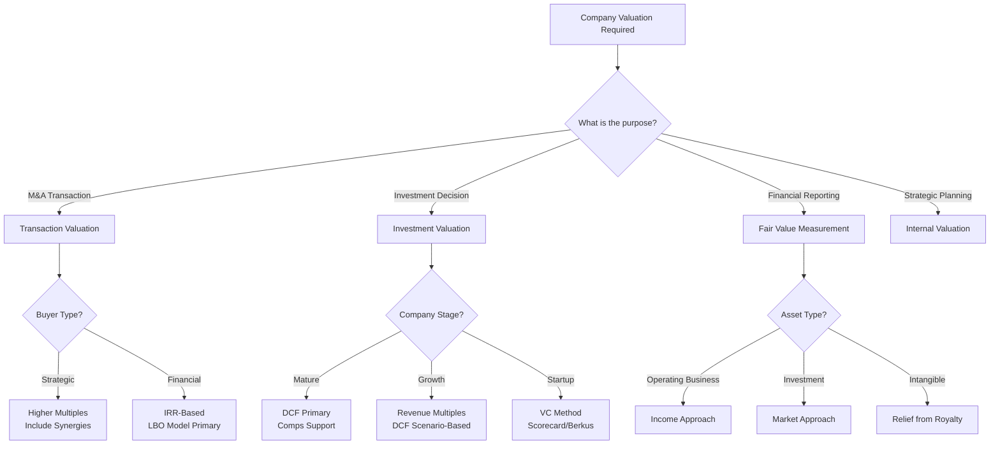

# Valuation Decision Trees & Framework Selection Guide

## Master Decision Tree for Valuation Method Selection



## Detailed Decision Framework by Situation

### 1. Industry-Specific Valuation Selection

```
Technology Companies
├── SaaS/Subscription
│   ├── Profitable → EV/EBITDA (15-25x) + DCF
│   ├── High Growth → EV/Revenue (5-15x) + EV/ARR
│   └── Early Stage → ARR Multiples (3-10x)
│
├── Hardware/Manufacturing
│   ├── Mature → P/E (15-20x) + DCF
│   └── Growth → EV/Revenue (1-3x) + PEG
│
└── Platform/Marketplace
    ├── Network Effects → GMV Multiples + User-Based
    └── Traditional → Take Rate Analysis + DCF

Financial Services
├── Banks
│   ├── Commercial → P/B (0.8-1.5x) + P/E
│   ├── Investment → P/TBV + ROE Analysis
│   └── Distressed → P/aTBV + Credit Models
│
├── Insurance
│   ├── Life → Embedded Value + P/B
│   ├── P&C → P/E (10-15x) + Combined Ratio
│   └── Reinsurance → P/B + Cat Modeling
│
└── Asset Management
    ├── Traditional → % of AUM (1-3%)
    └── Alternative → Carried Interest NPV

Healthcare
├── Pharma
│   ├── Big Pharma → P/E + Pipeline NPV
│   ├── Biotech → Risk-Adjusted NPV
│   └── Generic → EV/EBITDA (8-12x)
│
├── Medical Devices
│   ├── Established → EV/EBITDA + DCF
│   └── Innovative → Revenue Multiple + Milestone
│
└── Healthcare Services
    ├── Hospitals → EV/EBITDA (8-12x)
    └── Outpatient → EV/Revenue (0.5-2x)
```

### 2. Transaction Context Decision Tree

```
Control Premium Determination
├── Public to Private
│   ├── Strategic Buyer → 30-50% premium
│   ├── Financial Buyer → 20-30% premium
│   └── Management Buyout → 15-25% premium
│
├── Private Company Sale
│   ├── Competitive Auction → Use highest comparables
│   ├── Negotiated Sale → DCF + Comps average
│   └── Distressed Sale → Liquidation value baseline
│
└── Minority Investment
    ├── Passive → Apply DLOM (20-35%)
    ├── Board Seat → DLOM (10-20%)
    └── Strategic Rights → Minimal/No DLOM
```

### 3. Market Condition Adjustments

```
Market Environment Impact
├── Bull Market (VIX < 20)
│   ├── Multiple Expansion → Use 75th percentile
│   ├── Lower WACC → Risk-free -50bps
│   └── Higher Terminal Growth → +0.5-1%
│
├── Normal Market (VIX 20-30)
│   ├── Median Multiples
│   ├── Standard WACC
│   └── Historical Terminal Growth
│
└── Bear Market (VIX > 30)
    ├── Multiple Compression → Use 25th percentile
    ├── Higher WACC → Risk-free +100bps
    └── Conservative Terminal Growth → GDP or lower
```

## Weighting Methodology Decision Framework

### Dynamic Weighting Based on Reliability

```python
def calculate_method_weights(company_profile, market_conditions):
    """
    Dynamically weight valuation methods based on:
    - Data availability and quality
    - Market conditions
    - Company characteristics
    """
    
    weights = {
        'DCF': 0.4,  # Base weight
        'Comps': 0.3,
        'Precedents': 0.2,
        'Other': 0.1
    }
    
    # Adjust for data quality
    if company_profile['forecast_reliability'] == 'Low':
        weights['DCF'] -= 0.1
        weights['Comps'] += 0.1
    
    # Adjust for market volatility
    if market_conditions['volatility'] == 'High':
        weights['Comps'] -= 0.1
        weights['DCF'] += 0.1
    
    # Adjust for comparable availability
    if company_profile['comparable_count'] < 5:
        weights['Comps'] -= 0.1
        weights['Precedents'] += 0.1
    
    # Normalize weights
    total = sum(weights.values())
    weights = {k: v/total for k, v in weights.items()}
    
    return weights
```

### Scenario-Based Weighting Matrix

| Scenario | DCF | Comps | Precedents | Asset | Special |
|----------|-----|-------|------------|-------|---------|
| IPO Valuation | 30% | 50% | 20% | - | - |
| M&A (Strategic) | 40% | 25% | 35% | - | - |
| M&A (Financial) | 30% | 20% | 20% | - | 30% (LBO) |
| Restructuring | 20% | 10% | 10% | 40% | 20% |
| Growth Equity | 35% | 35% | 20% | - | 10% (VC) |
| Fair Value | 50% | 30% | 10% | 10% | - |

## Special Situations Decision Framework

### 1. Distressed Company Valuation

```
Distressed Valuation Hierarchy
├── Going Concern Test
│   ├── Pass → Modified DCF + Recovery Analysis
│   └── Fail → Liquidation Analysis
│
├── Liquidation Analysis
│   ├── Orderly Liquidation → 60-80% of book
│   ├── Forced Liquidation → 20-40% of book
│   └── Asset-by-Asset → Specialist appraisals
│
└── Restructuring Scenarios
    ├── Debt-to-Equity Swap → Post-reorg valuation
    ├── Asset Sales → Sum of parts
    └── DIP Financing → Waterfall analysis
```

### 2. High-Growth Company Framework

```
Growth Company Valuation Path
├── Revenue Stage
│   ├── Pre-Revenue → Berkus Method
│   ├── < $1M ARR → Scorecard + First Chicago
│   ├── $1-10M ARR → Revenue Multiple (5-15x)
│   └── > $10M ARR → Rule of 40 + DCF
│
├── Profitability Path
│   ├── Burn Multiple < 1x → Premium valuation
│   ├── Burn Multiple 1-2x → Standard valuation
│   └── Burn Multiple > 2x → Discount applied
│
└── Market Position
    ├── Market Leader → 75th percentile multiples
    ├── Challenger → Median multiples
    └── Laggard → 25th percentile multiples
```

### 3. Cross-Border Valuation Adjustments

```
International Valuation Framework
├── Developed Markets
│   ├── Same Currency → Standard methods
│   ├── Different Currency → Forward rate adjustment
│   └── Political Risk → Country risk premium
│
├── Emerging Markets
│   ├── Country Risk Premium → +200-500 bps
│   ├── Currency Risk → Monte Carlo required
│   └── Liquidity Discount → 20-40%
│
└── Frontier Markets
    ├── Sovereign Ceiling → Max rating = Country
    ├── Capital Controls → Additional 30-50% discount
    └── Data Quality → Scenario analysis critical
```

## Implementation Decision Guide

### Quick Reference Decision Matrix

```python
def select_primary_method(
    company_type, 
    purpose, 
    data_availability, 
    market_conditions
):
    """
    Returns primary and secondary valuation methods
    """
    
    decision_matrix = {
        ('mature', 'acquisition', 'high', 'stable'): ('DCF', 'Precedents'),
        ('mature', 'acquisition', 'low', 'stable'): ('Comps', 'Precedents'),
        ('growth', 'investment', 'high', 'stable'): ('DCF', 'Comps'),
        ('growth', 'investment', 'low', 'volatile'): ('Comps', 'Revenue Multiple'),
        ('startup', 'investment', 'low', 'any'): ('VC Method', 'Scorecard'),
        ('distressed', 'restructuring', 'any', 'any'): ('Liquidation', 'Recovery'),
    }
    
    key = (company_type, purpose, data_availability, market_conditions)
    return decision_matrix.get(key, ('DCF', 'Comps'))
```

### Validation Checklist

Before finalizing any valuation:

- [ ] **Sanity Check**: Is the implied P/E reasonable for the industry?
- [ ] **Growth/Multiple Fit**: Does high growth justify high multiples?
- [ ] **Capital Structure**: Is the debt sustainable at this valuation?
- [ ] **Market Check**: How does this compare to recent transactions?
- [ ] **Scenario Test**: What happens in downside scenarios?
- [ ] **Time Horizon**: Are we using appropriate forecast periods?
- [ ] **Terminal Assumptions**: Is terminal growth < GDP + inflation?

## Advanced Decision Frameworks

### ESG Integration Decision Tree

```
ESG Impact Assessment
├── ESG Data Quality
│   ├── High (Verified) → Direct WACC adjustment
│   ├── Medium → Scenario analysis
│   └── Low → Qualitative overlay only
│
├── Materiality Assessment
│   ├── High Impact Industry → 100-200 bps adjustment
│   ├── Medium Impact → 50-100 bps adjustment
│   └── Low Impact → 0-50 bps adjustment
│
└── Trend Analysis
    ├── Improving → Apply positive momentum factor
    ├── Stable → Use current scores
    └── Deteriorating → Add risk premium
```

### Technology Disruption Framework

```
Disruption Risk Assessment
├── Industry Disruption Level
│   ├── High (e.g., Retail, Media) → Shorten forecast period
│   ├── Medium → Standard period with scenarios
│   └── Low (e.g., Utilities) → Longer forecast acceptable
│
├── Company Position
│   ├── Disruptor → Innovation premium applied
│   ├── Adapter → Market multiples
│   └── Disrupted → Significant discount
│
└── Valuation Adjustment
    ├── Winner-take-all → Real options valuation
    ├── Fragmented → Traditional multiples
    └── Platform → Network effects premium
```

## Real Options Decision Framework

When to use Real Options valuation:

```
Real Options Applicability
├── High Uncertainty + High Flexibility → USE
│   ├── Natural resources
│   ├── Pharma R&D
│   ├── Technology platforms
│   └── Infrastructure projects
│
├── Staged Investment → USE
│   ├── Venture capital rounds
│   ├── Mining development
│   └── Real estate development
│
└── Irreversible Investment → CONSIDER
    ├── Large CapEx projects
    ├── Market entry decisions
    └── Technology adoption
```

## Quick Decision Tool

### 30-Second Valuation Method Selector

1. **Is the company profitable?**
   - Yes → Go to 2
   - No → Use Revenue multiples or VC method

2. **Do you have reliable projections?**
   - Yes → DCF is primary
   - No → Comps are primary

3. **Are there good comparables?**
   - Yes → Weight Comps 40%+
   - No → Increase DCF weight

4. **Is this for a transaction?**
   - Yes → Include Precedent transactions
   - No → Focus on DCF + Comps

5. **Special situations?**
   - Distressed → Liquidation analysis
   - High growth → Revenue multiples
   - Cross-border → Add country premium