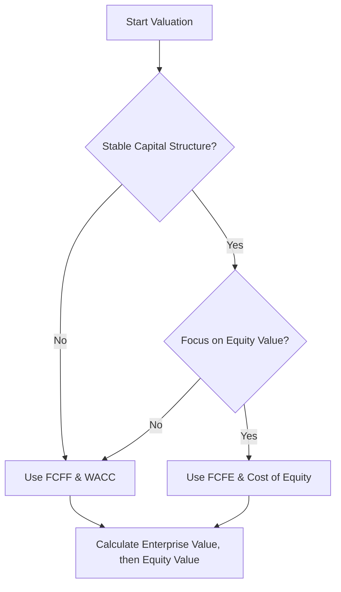

# Advanced Company Valuation Methodologies: Research and Documentation (2026-02-09)

This document provides a comprehensive overview of advanced company valuation methodologies, integrating academic rigor with practical application for strategic intelligence and investment decisions.

## 1. DCF Modeling and Free Cash Flow Calculations

Discounted Cash Flow (DCF) modeling is a core valuation technique that estimates the intrinsic value of an asset based on the present value of its expected future cash flows. The accuracy of a DCF model heavily relies on the precise calculation and forecasting of Free Cash Flow to Firm (FCFF) or Free Cash Flow to Equity (FCFE).

### 1.1 Free Cash Flow to Firm (FCFF)

**Definition:**
Free Cash Flow to Firm (FCFF), often referred to as Unlevered Free Cash Flow, represents the total amount of cash flow generated by a company's operations that is available to all providers of capital (both debt and equity holders) *before* any debt payments or dividend distributions. It is a measure of a company's operating performance independent of its capital structure.

**Advanced Approaches and Calculations:**
FCFF can be calculated from various starting points on a company's financial statements. A key principle is to ensure the cash flow is "unlevered," meaning it excludes the effects of debt financing.

1.  **From Net Operating Profit After Taxes (NOPAT):**
    This is often considered the most analytically robust approach as it starts with a measure of profit that is already unlevered.
    *   **NOPAT = EBIT × (1 - Tax Rate)**
    *   **FCFF = NOPAT + Depreciation & Amortization (D&A) - Change in Net Working Capital (NWC) - Capital Expenditures (CapEx)**

    *Explanation:*
    *   **NOPAT:** Represents the hypothetical after-tax profit if the company had no debt.
    *   **D&A:** Added back because it's a non-cash expense.
    *   **Change in NWC:** An increase in NWC is a cash outflow (e.g., more inventory or accounts receivable), and a decrease is a cash inflow. This adjustment ensures the cash flow reflects operational needs.
    *   **CapEx:** Deducted as it represents cash spent on long-term assets necessary for maintaining or growing operations.

2.  **From Net Income:**
    This approach starts from a "levered" profit measure and requires adjustments to make it unlevered.
    *   **FCFF = Net Income + D&A + Interest Expense × (1 - Tax Rate) - Change in NWC - CapEx**

    *Explanation:*
    *   **Net Income:** Reverts to an unlevered basis by adding back the after-tax interest expense. The `(1 - Tax Rate)` factor accounts for the tax shield benefit of interest.
    *   Other components (D&A, Change in NWC, CapEx) are adjusted similarly to the NOPAT method.

3.  **From Cash Flow from Operations (CFO):**
    CFO is a readily available figure from the cash flow statement, but also needs adjustment to be unlevered for FCFF.
    *   **FCFF = CFO + Interest Expense × (1 - Tax Rate) - CapEx**

    *Explanation:*
    *   **CFO:** Already includes adjustments for non-cash items and changes in working capital.
    *   **Interest Expense × (1 - Tax Rate):** Added back to remove the effect of financing costs and their tax shield.
    *   **CapEx:** Deducted as it's typically found in the investing activities section and isn't included in CFO.

**Academic Sources and Practical Application:**
*   **Academic Rigor:** FCFF is a foundational concept in corporate finance and valuation, extensively covered in texts like "Valuation: Measuring and Managing the Value of Companies" by McKinsey & Company, Koller, Goedhart, and Wessels, and "Investment Valuation" by Aswath Damodaran. CFA Institute curriculum also heavily emphasizes FCFF.
*   **Management Accounting & KPI Design:** FCFF serves as a critical KPI for assessing a company's underlying operational profitability and efficiency, independent of its financing decisions. Management can use FCFF to evaluate the effectiveness of operational strategies, capital allocation, and overall business health. It helps in understanding the total cash-generating capacity available for all capital providers, which is crucial for strategic planning, dividend policy, and debt repayment capacity.
*   **Real-World Examples:** Often used by financial analysts, private equity firms, and corporate development teams to value target companies for M&A, capital budgeting, and strategic investments. For instance, in evaluating a manufacturing firm, FCFF would provide a clear picture of the cash generated from producing and selling goods before considering how that cash is split between debt and equity.

### 1.2 Free Cash Flow to Equity (FCFE)

**Definition:**
Free Cash Flow to Equity (FCFE) represents the cash flow remaining that is available for distribution to the company's equity holders *after* all operating expenses, reinvestment needs (CapEx and working capital), and debt obligations (principal and interest) have been met. It is a "levered" cash flow measure.

**Advanced Approaches and Calculations:**
FCFE calculations also have several variations, all aiming to arrive at the cash available to shareholders.

1.  **From Net Income:**
    This is a common method, starting directly from the bottom line of the income statement.
    *   **FCFE = Net Income + D&A - Change in NWC - CapEx + Net Borrowing**

    *Explanation:*
    *   **Net Income:** Reflects earnings after interest and taxes.
    *   **D&A:** Added back as a non-cash expense.
    *   **Change in NWC & CapEx:** Deducted as reinvestment needs.
    *   **Net Borrowing:** Added (if positive, new debt issued) or deducted (if negative, debt repaid), as it directly impacts cash available to equity holders. This adjustment makes the FCFE truly "levered."

2.  **From Cash Flow from Operations (CFO):**
    *   **FCFE = CFO - CapEx + Net Borrowing**

    *Explanation:*
    *   **CFO:** Already incorporates Net Income, D&A, and changes in NWC.
    *   **CapEx:** Deducted as it is an investing activity.
    *   **Net Borrowing:** Added/deducted as it represents the net impact of debt financing on cash available to equity.

3.  **From EBIT/EBITDA (Less Common for Direct FCFE):**
    While less direct, FCFE can be derived from unlevered metrics by systematically accounting for interest, taxes, and debt principal payments.
    *   **FCFE = EBIT × (1 - Tax Rate) + D&A - Change in NWC - CapEx + Net Borrowing - Interest Expense**
    *   This essentially takes NOPAT, adds D&A, subtracts investments, then subtracts the after-tax impact of interest and net debt repayments.

**Academic Sources and Practical Application:**
*   **Academic Rigor:** FCFE is also a fundamental concept in valuation literature, detailed in the same foundational texts as FCFF. It is particularly relevant for investors focused on shareholder distributions.
*   **Management Accounting & KPI Design:** FCFE serves as a crucial KPI for understanding the cash generated available for shareholders, directly impacting dividend potential, share buybacks, or accumulation of cash reserves. For companies that aim to maximize shareholder returns through distributions, FCFE is a key metric. It provides insights for decisions on capital structure and payout policies.
*   **Real-World Examples:** Used by equity investors, analysts, and portfolio managers to assess a company's capacity to generate cash for its owners. It's especially useful for companies with stable debt levels or in situations where the investor has a "control" perspective and can influence financing or dividend decisions. For instance, a growth-oriented tech company might show lower FCFE due to heavy reinvestment, indicating higher future growth potential rather than immediate distributions.

### 1.3 Connection to DCF Valuation

*   **FCFF in DCF:** When using FCFF, the cash flows represent the value for all capital providers, so they are discounted by the Weighted Average Cost of Capital (WACC) to arrive at the Enterprise Value (EV). Equity Value is then derived by subtracting the market value of debt and preferred stock, and adding cash and equivalents.
*   **FCFE in DCF:** When using FCFE, the cash flows represent the value for equity holders directly, so they are discounted by the Cost of Equity (typically calculated using the Capital Asset Pricing Model - CAPM) to arrive directly at the Equity Value.

The choice between FCFF and FCFE depends on the stability of the company's capital structure and the perspective of the valuation (firm vs. equity). FCFF is generally preferred due to its independence from capital structure changes and broader applicability.

### 1.4 Conceptual Outline for Template/Decision Tree

**Template for Free Cash Flow Calculation (Excel/Spreadsheet):**

| Line Item                     | Year 1 | Year 2 | Year 3 | Year 4 | Year 5 |
| :---------------------------- | :----- | :----- | :----- | :----- | :----- |
| **I. Operating Performance**    |        |        |        |        |        |
| Revenue                       | [Input]| [Forecast]| [Forecast]| [Forecast]| [Forecast]|
| COGS                          | [Input]| [Forecast]| [Forecast]| [Forecast]| [Forecast]|
| Gross Profit                  |        |        |        |        |        |
| Operating Expenses            | [Input]| [Forecast]| [Forecast]| [Forecast]| [Forecast]|
| **EBIT**                      |        |        |        |        |        |
| Tax Rate                      | [Input]| [Input]| [Input]| [Input]| [Input]|
| **NOPAT (EBIT * (1-Tax Rate))**|        |        |        |        |        |
|                               |        |        |        |        |        |
| **II. Non-Cash & Reinvestment** |        |        |        |        |        |
| Depreciation & Amortization (D&A)| [Input]| [Forecast]| [Forecast]| [Forecast]| [Forecast]|
| Change in Net Working Capital (NWC)| [Input]| [Forecast]| [Forecast]| [Forecast]| [Forecast]|
| Capital Expenditures (CapEx)  | [Input]| [Forecast]| [Forecast]| [Forecast]| [Forecast]|
|                               |        |        |        |        |        |
| **III. Financing (for FCFE)**   |        |        |        |        |        |
| Net Borrowing / (Repayment)   | [Input]| [Forecast]| [Forecast]| [Forecast]| [Forecast]|
| Interest Expense              | [Input]| [Forecast]| [Forecast]| [Forecast]| [Forecast]|
|                               |        |        |        |        |        |
| **IV. Free Cash Flows**         |        |        |        |        |        |
| **FCFF**                      | **[Calculated]**| **[Calculated]**| **[Calculated]**| **[Calculated]**| **[Calculated]**|
| **FCFE**                      | **[Calculated]**| **[Calculated]**| **[Calculated]**| **[Calculated]**| **[Calculated]**|
|                               |        |        |        |        |        |
| **V. Discount Rates**           |        |        |        |        |        |
| WACC                          | [Input]|        |        |        |        |
| Cost of Equity (Ke)           | [Input]|        |        |        |        |

**Decision Tree for Choosing FCFF vs. FCFE:**

*   **Rule 1: Capital Structure Stability:** If the company's debt-to-equity ratio is expected to remain relatively constant, either FCFF or FCFE can be used. If it's expected to change significantly, FCFF is generally preferred as it's independent of financing decisions.
*   **Rule 2: Control Perspective:** If the valuation is from a control perspective (e.g., M&A), FCFF is often preferred as the acquirer can optimize the capital structure. If it's a minority shareholder perspective, FCFE might be more relevant.
*   **Rule 3: Data Availability & Reliability:** FCFF calculations from NOPAT often require more granular data and assumptions. If only Net Income and CFO data are readily available, FCFE might be a more straightforward (though sometimes less robust) starting point.
